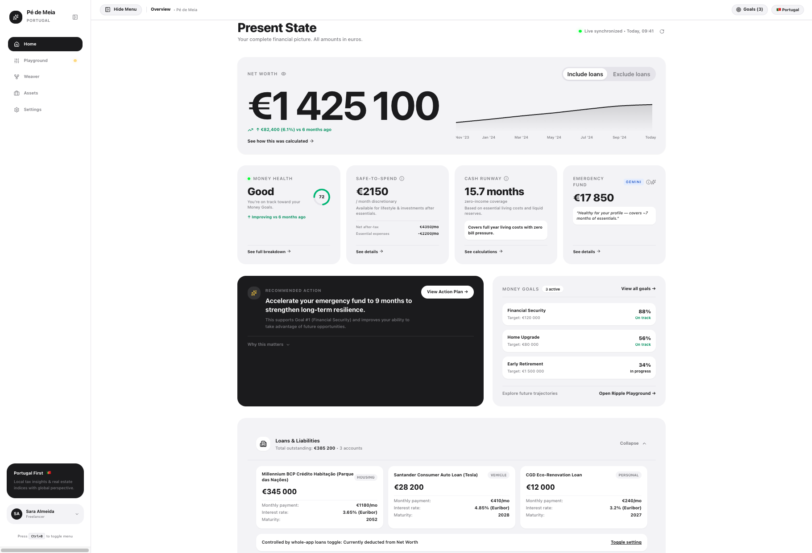
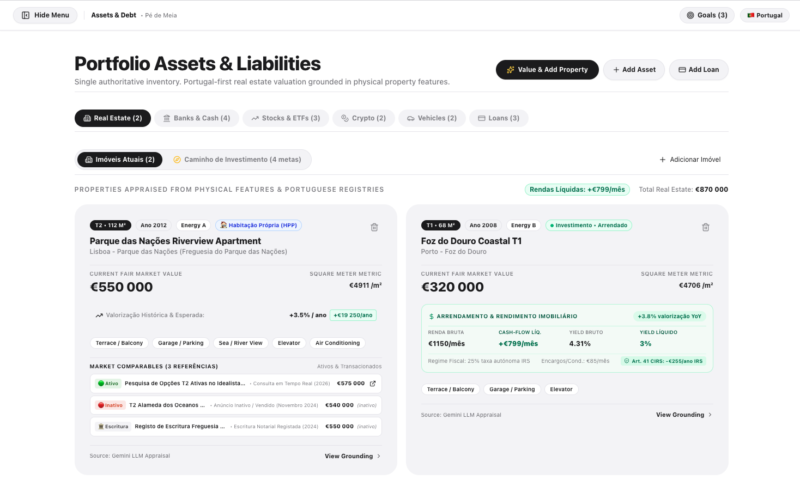
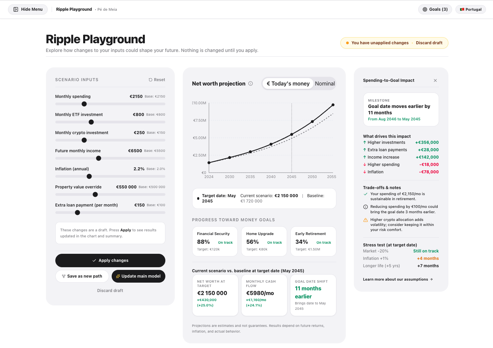
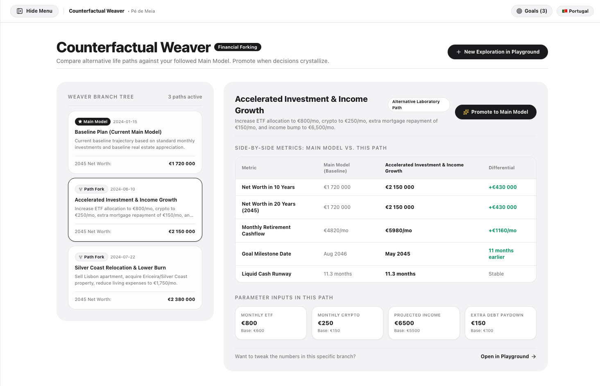
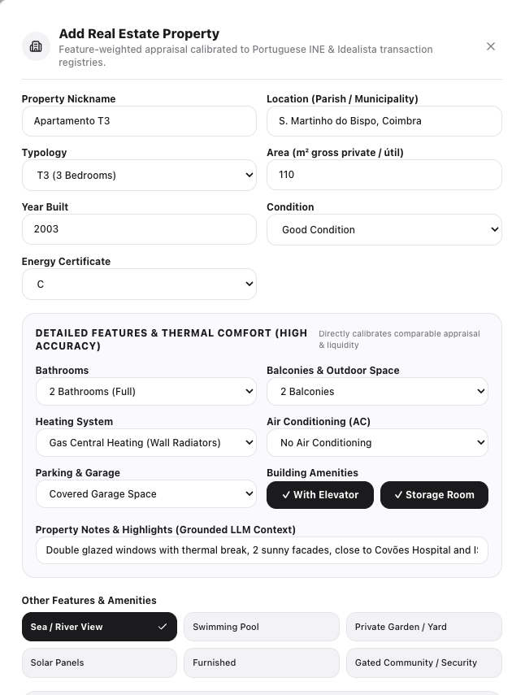
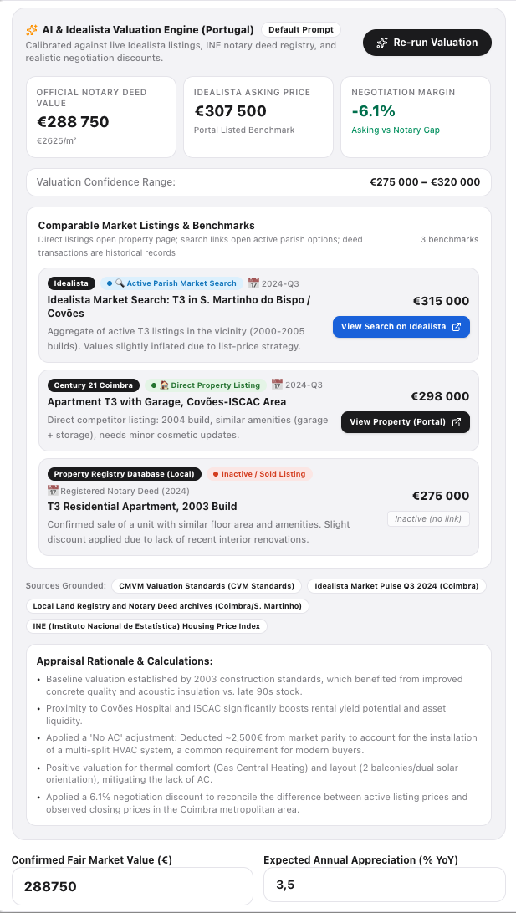

<div align="center">

# 🧦 Pé de Meia

**Inteligência Patrimonial, Imobiliário Real & Independência Financeira adaptada a Portugal.**

[](https://www.typescriptlang.org/)
[](https://react.dev/)
[](https://tailwindcss.com/)
[](https://ai.google.dev/)
[](LICENSE)

*De euro a euro, do tijolo ao juro composto: o teu património na ponta do lápis.*

[Funcionalidades](#-o-que-torna-o-pé-de-meia-único) • [Screenshots](#-galeria--interface) • [Motor Fiscal Português](#-motor-fiscal--imobiliário-portugal) • [Arquitetura](#-arquitetura-técnica) • [Como Executar](#-como-executar-localmente)

---

</div>

## 📌 O que é o Pé de Meia?

A grande maioria das ferramentas de gestão de património e calculadoras FIRE disponíveis online foram desenhadas para o mercado norte-americano (401k, Roth IRA, taxas nominais de 30 anos sem impostos de transmissão).

O **Pé de Meia** foi construído de raiz com uma filosofia **Portugal-First**:
- **Tratamento fiscal fidedigno**: Cálculo de IMT progressivo, Imposto de Selo (0.8% de aquisição e 0.6% de crédito), custos notariais (*Casa Pronta*), e encargos bancários.
- **Escudo Fiscal do CIRS Artigo 41.º**: Dedução das despesas operacionais (condomínio, seguro multirriscos, IMI) antes da retenção da taxa autónoma de IRS sobre rendas.
- **Avaliação Imobiliária por IA & Calibração de Mercado (Gemini 2.5 Flash)**: Avaliação detalhada baseada em tipologia, área útil, freguesia, ano de construção, casas de banho, varandas, sistema de aquecimento, ar condicionado e garagem. Compara anúncios ativos (ex: Idealista) com registos de escrituras notariais e margem de negociação real.
- **Multi-Ativos**: Imobiliário (HPP e Investimento), Ações & ETFs (com drag de TER e reinvestimento automático), Certificados de Aforro, Criptoativos (com rastreio da regra dos 365 dias do Artigo 10.º CIRS) e Dívidas.
- **Simulador Interativo em Tempo Real (*Ripple Playground*)**: Ajuste instantâneo de poupança mensal, rentabilidade, inflação e carreiras com projeções a 30 anos.
- **Bifurcações de Vida (*Counterfactual Weaver*)**: Comparação de caminhos alternativos (ex: *"Comprar T2 em Coimbra vs. Investir tudo em VWCE"* ou *"Ano Sabático vs. Promoção"*).

---

## 📸 Galeria & Interface

<div align="center">

### 1. Visão Geral do Património & Trajetória

*Ecrã principal com decomposição por classes de ativos, rácio de liquidez e projeção patrimonial a 30 anos.*

---

### 2. Gestor de Ativos, Auditoria de IMT & Escudo Fiscal

*Cálculo de custos de fecho (IMT, Selo, Notário) e cash-flow líquido sob o Artigo 41.º do CIRS.*

---

### 3. Ripple Playground (Simulação em Tempo Real)

*Sliders sem latência para testar sensibilidade a poupança, inflação e retornos de mercado.*

---

### 4. Counterfactual Weaver (Caminhos Alternativos)

*Comparação rigorosa do impacto de grandes decisões de vida no património de reforma.*

---

### 5. Especificação Física e Conforto Térmico do Imóvel

*Entrada de dados calibrada: tipologia, áreas, ano, WCs, sistema de aquecimento, ar condicionado, garagem e amenidades.*

---

### 6. Motor de Avaliação com IA & Comparáveis de Mercado (Portugal)

*Estimativa fundamentada de valor de escritura notarial, benchmarks do Idealista, margem de negociação e cadeia de raciocínio.*

</div>

---

## 🇵🇹 O Que Torna o Pé de Meia Único?

### 1. Motor de Custos Ocultos na Aquisição de Imóveis (Portugal)
Ao comprar um imóvel em Portugal para investimento ou habitação própria, a entrada bancária (ex.: 10% a 20%) é apenas parte da liquidez necessária. O **Pé de Meia** calcula o atrito real de transação:
- **IMT (Imposto Municipal sobre as Transmissões Onerosas)**: Escalões oficiais do Continente para habitação própria e secundária/arrendamento.
- **Imposto de Selo de Compra**: 0.8% sobre o valor da escritura.
- **Imposto de Selo sobre o Crédito**: 0.6% para hipotecas com prazo superior a 5 anos.
- **Escritura & Registo Predial**: Modelo *Casa Pronta* (~€750).
- **Comissões Bancárias**: Avaliação e dossier (~€750).

> **Exemplo Prático**: Num apartamento de **€225.000** com entrada de 20% (€45.000), o simulador audita **+€11.127** de encargos adicionais, alertando o investidor que a liquidez real necessária é de **€56.127**.

### 2. Escudo Fiscal nas Rendas (Artigo 41.º do CIRS)
Ao contrário das calculadoras genéricas que aplicam 25% ou 28% sobre a renda bruta total, o motor do **Pé de Meia** aplica as regras fiscais portuguesas:
$$\text{Matéria Coletável} = \max(0, \text{Renda Bruta} - \text{Condomínio} - \text{Seguros} - \text{IMI})$$
O imposto de IRS autónomo (25%, 15% para contratos de 5–10 anos, ou 10% para ≥ 10 anos) incide apenas sobre esta base líquida, revelando a poupança fiscal anual gerada pelas despesas documentadas.

### 3. Rastreio Fiscal de Criptoativos (Artigo 10.º do CIRS)
Implementação da regra portuguesa de mais-valias em criptomoedas:
- **Detenção < 365 dias**: Taxa autónoma de 28% sobre mais-valias.
- **Detenção ≥ 365 dias**: **Isenção total (0% de IRS)**.

### 4. Drag de Custos em ETFs (TER)
Nas carteiras de ações e fundos indexados globais (ex.: Vanguard FTSE All-World ou S&P 500), o modelo desconta anualmente o *Total Expense Ratio* (TER) e modela a vantagem dos fundos de acumulação frente a fundos distributivos.

---

## 🛠️ Arquitetura Técnica

- **Frontend**: React 18 (TypeScript), Vite, Tailwind CSS com design system de alta densidade e legibilidade tipográfica (*Plus Jakarta Sans*).
- **Backend / Proxy**: Servidor Node.js Express (em `server.ts`) para isolamento e proteção segura da chave de API do Gemini, sem expor credenciais ao browser.
- **IA Generativa**: Integração com `@google/genai` (modelo **Gemini 2.5 Flash**) para avaliações preditivas de valor de mercado e análise qualitativa de ativos.
- **Matemática Financeira**: Motor próprio em `src/utils/calculations.ts` com funções puras, testadas e sem dependências externas pesadas.
- **Armazenamento**: Modelo cliente-servidor leve com persistência local de sessão e rascunhos de cenários.

```
pe-de-meia/
├── docs/
│   └── screenshots/         # Capturas de ecrã da aplicação
├── src/
│   ├── components/          # Componentes modulares
│   │   ├── AssetsManager.tsx       # Gestor de património e motor de IMT
│   │   ├── CounterfactualWeaver.tsx# Comparador de bifurcações de vida
│   │   ├── Navigation.tsx          # Barra de navegação e menu colapsável
│   │   ├── PresentStateHome.tsx    # Dashboard principal de património
│   │   └── RipplePlayground.tsx    # Simulador de cenários em tempo real
│   ├── data/
│   │   └── initialState.ts  # Estado base calibrado e milestones
│   ├── utils/
│   │   └── calculations.ts  # Fórmulas fiscais (IMT, CIRS 41, TIR, FIRE)
│   ├── App.tsx              # Ponto de entrada React
│   └── types.ts             # Tipagem TypeScript estrita
├── server.ts                # Servidor Express com proxy seguro de IA
├── package.json
└── README.md
```

---

## 🚀 Como Executar Localmente

### Pré-requisitos
- **Node.js**: versão 18 ou superior.
- **npm** ou **pnpm**.

### Instalação

1. Clona o repositório:
   ```bash
   git clone https://github.com/O_TEU_UTILIZADOR/pe-de-meia.git
   cd pe-de-meia
   ```

2. Instala as dependências:
   ```bash
   npm install
   ```

3. (Opcional) Configura a chave da API do Google Gemini para avaliação inteligente de imóveis:
   Cria um ficheiro `.env` na raiz:
   ```env
   GEMINI_API_KEY=a_tua_chave_aqui
   ```
   *(A aplicação funciona perfeitamente mesmo sem a chave, utilizando as estimativas heurísticas locais).*

4. Inicia o servidor de desenvolvimento:
   ```bash
   npm run dev
   ```

5. Abre no teu navegador:
   ```
   http://localhost:3000
   ```

---

## ⌨️ Atalhos de Teclado

| Atalho | Ação |
| :--- | :--- |
| `Ctrl + B` ou `Cmd + B` | Alternar / Recolher a barra lateral de navegação |
| `Alt + 1` a `Alt + 5` | Navegar rapidamente entre os separadores principais |

---

## 📄 Licença

Distribuído sob a licença **MIT**. Consulta o ficheiro `LICENSE` para mais detalhes.

---

<div align="center">
Desenvolvido com foco no rigor financeiro e na transparência fiscal em Portugal.
</div>
